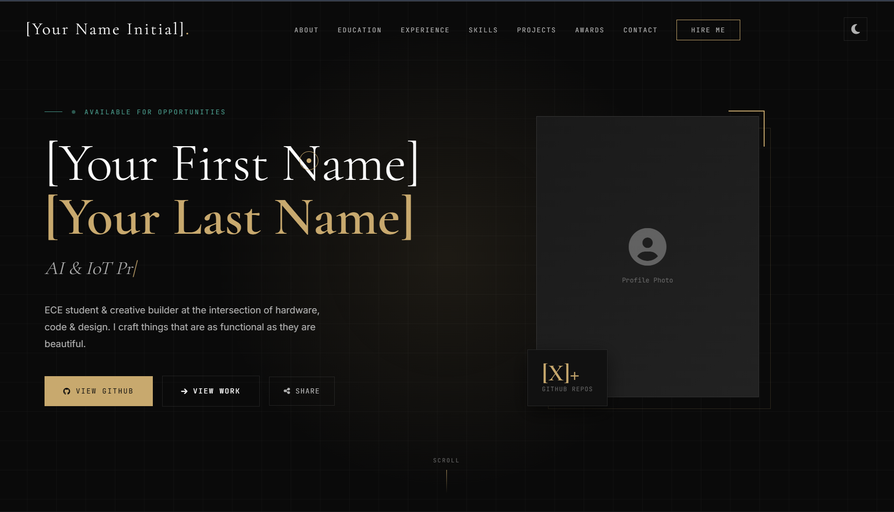
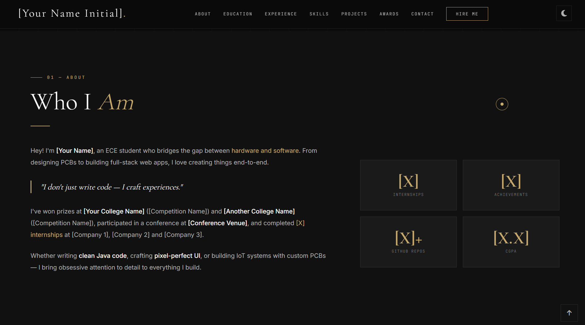
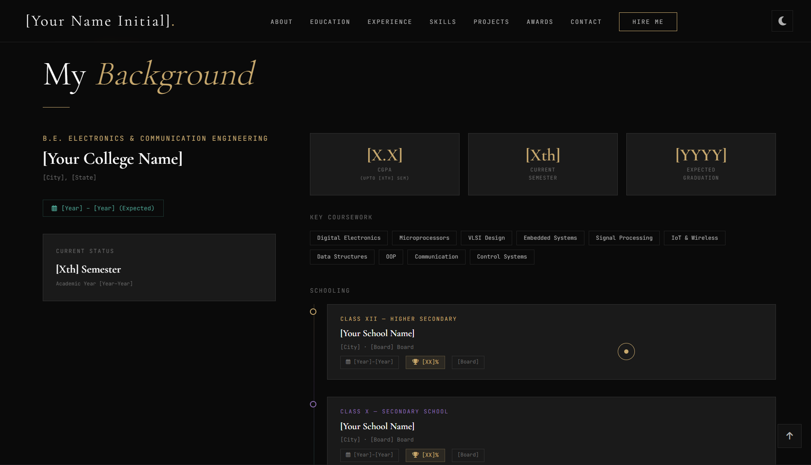
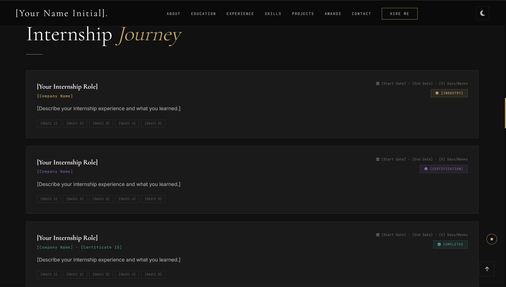
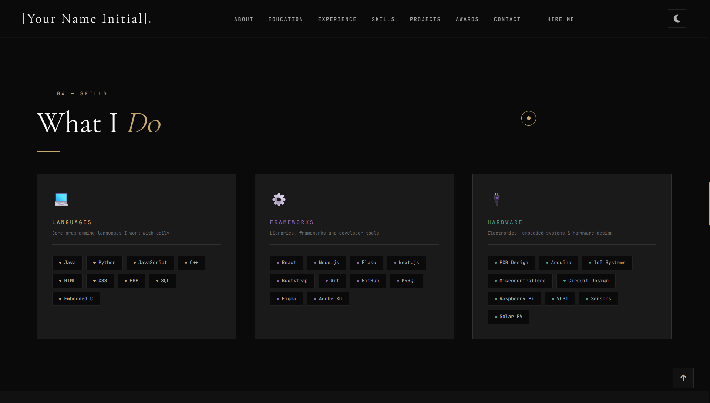
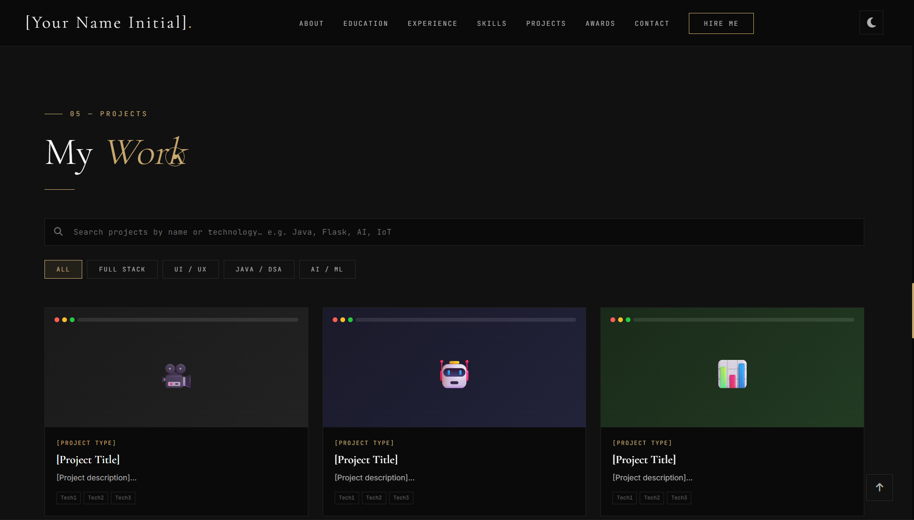
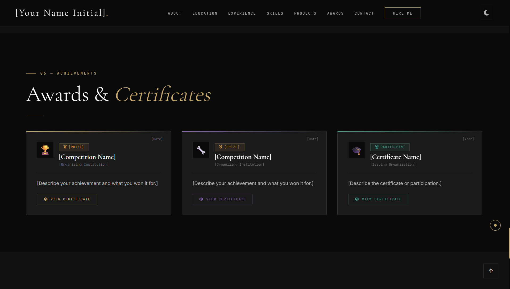

# 🚀 Modern Developer Portfolio

A **modern animated developer portfolio template** built using **HTML, CSS and JavaScript**.
Designed for students and developers who want a **clean, professional personal website** with animations, projects, certificates and contact features.

---

# 🌐 Live Demo

View the portfolio live:

https://sachindeepak.dev

---

# 📸 Portfolio Preview

## Hero Section



## About Section



## Education Section



## Experience Section



## Skills Section



## Projects Section



## Certificates Section



## Contact Section


---

# ✨ Features

* 🌙 Dark / Light Theme
* ⚡ Smooth animations
* 🎨 Modern UI design
* 🔎 Project search and filtering
* 🏆 Certificates modal preview
* 📬 Contact form integration
* 📱 Fully responsive layout
* 🔗 Social media integration
* 🚀 Easy deployment

---

# 🛠 Tech Stack

### Frontend

* HTML5
* CSS3
* JavaScript

### Libraries

* Font Awesome
* Google Fonts

### Deployment

* GitHub Pages
* Netlify
* Vercel

---

# ⚙️ Installation

Clone the repository

```bash
git clone https://github.com/Sachin-deepak-S/modern-developer-portfolio.git
```

Open the folder

```bash
cd modern-developer-portfolio
```

Run the project

Open `index.html` in your browser.

---

# 🧩 Customization

To customize this portfolio:

1. Replace **Your Name**
2. Update **projects inside `projectsData`**
3. Replace **profile image**
4. Update **skills section**
5. Update **contact links**
6. Add your **certificates and achievements**

---

# 📁 Project Structure

```
modern-developer-portfolio
│
├── index.html
├── preview/
│   ├── hero.png
│   ├── about.png
│   ├── education.png
│   ├── experience.png
│   ├── skills.png
│   ├── projects.png
│   ├── certificates.png
│   └── contact.png
│
├── README.md
└── LICENSE
```

---

# 🌍 Deployment

You can deploy this portfolio using:

• GitHub Pages
• Netlify
• Vercel

Recommended:

**Netlify**

---

# 📜 License

This project is licensed under the **MIT License**.

You are free to use and modify this portfolio for your own personal website.

---

# 👨‍💻 Author

Created by **Sachin Deepak S**

GitHub
https://github.com/Sachin-deepak-S

LinkedIn
https://linkedin.com/in/sachin-deepak-s

---

⭐ If you like this project, please consider **starring the repository**.
